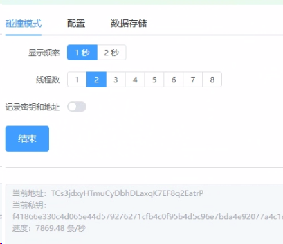

# 波场链地址批量生成 仅限于学习, 请勿用于其它用途.
## 功能
- 批量生成波场链地址
- 生成的地址记录到指定txt文件
- 配置待匹配的地址，生成符合条件的地址时可提示并记录到指定txt文件，系统会继续工作
- 多线程并发生成地址，视自己电脑配来调节
- 完全离线作业，不上传任何数据到服务器，也不依赖于网络

## 说明
- 仅限学习使用，请匆用于其它用途

Telegram: https://t.me/supervalid1

weixin: qq695000985
